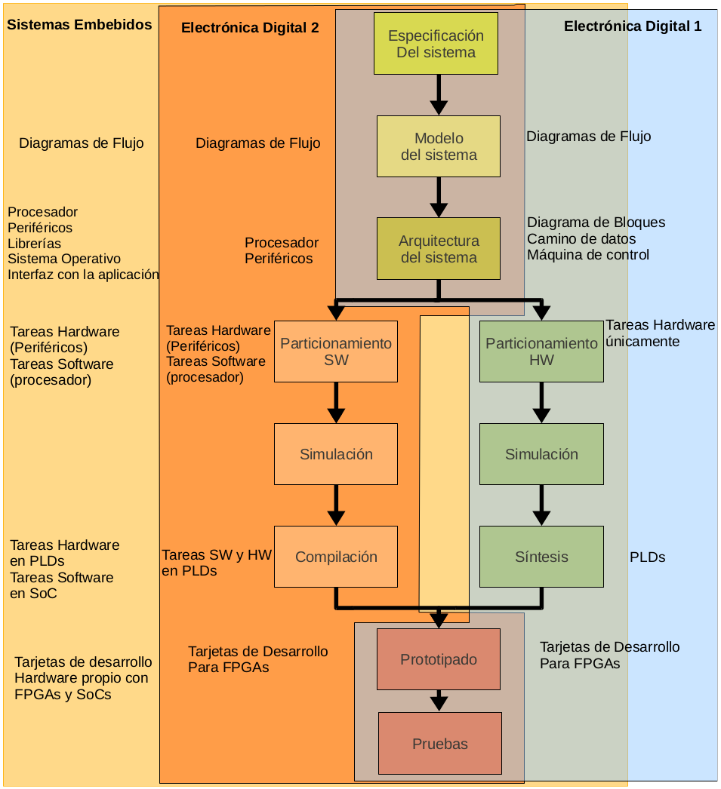

# Propuesta

### POO y Electrónica digital 1

Presentado por **Johnny Cubides**

----

## Agenda

* Paradigma de la POO
* Aprendizajes significativos
* Propuesta didáctica
* Flujo de diseño para sistemas digitales
* Ejemplo de proyecto

----

## Programación orientada a objetos (POO)

Es un paradigma que deriva de la programación imperativa y que estructura la
solución de un problema en términos de objetos. Cada objeto encapsula datos
(atributos) y comportamientos (métodos), y se relaciona con otros objetos para
cumplir responsabilidades específicas de manera organizada.

------

## Fundamentos de la POO

* Clases y objetos (plantillas e instancias)
* Encapsulamiento (get/set)
* Herencia
* Polimorfismo (comportamiento)
* Abstracción

------

### Objetivos de aprendizaje

* Comprender los conceptos fundamentales de la POO
* Diseñar sistemas modulares y escalables
* Fomentar la reutilización de código
* Resolver problemas aplicando el modelamiento de objetos
* Familiarizarse con herramientas relacionadas con este paradigma
* Crear soluciones prácticas

<!--.element: style="font-size: 80%;"-->

----

###### Aprendizaje contextualizado

<!-- .element: style="height: auto; width: 90%; display: block; margin: auto;" -->

------

#### Objetivos de aprendizaje significativo

* Problematizar situaciones reales
* Relacionar intereses y motivaciones con objetivos sociales globales
* Percibirse como agente de cambio de su propia realidad
* Desarrollar habilidades en contexto

----

#### Propuesta didáctica

----

#### Flujo de diseño

 

<!-- .element: style="height: auto; width: 80%; display: block; margin: auto;" -->

----

## Sistemas digitales

------

#### Niveles de abstracción

<!-- .element: style="height: auto; width: 80%; display: block; margin: auto;" -->

------

#### Flujo de diseño

<!-- .element: style="height: auto; width: 55%; display: block; margin: auto;" -->

----

## Ejemplo de aplicación

----

# Gracias
